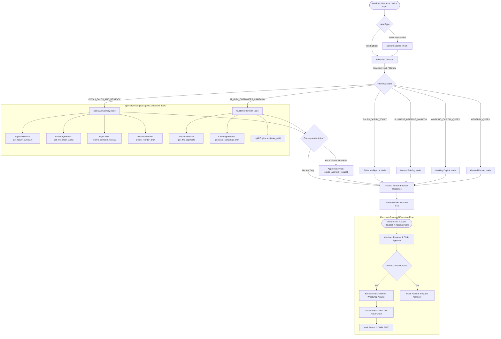

# Gullak AI — LangGraph Agent Orchestrator Workflow

```mermaid
flowchart TD
    Start([Merchant Utterance / Voice Input]) --> InputCheck{Input Type}
    
    InputCheck -->|Audio WAV/WebM| STT[Sarvam Saaras v4 STT]
    InputCheck -->|Text Fallback| IntentDet[IndicIntentDetector]
    
    STT --> IntentDet
    
    IntentDet -->|Hinglish / Hindi / Marathi| IntentMap{Intent Classifier}
    
    IntentMap -->|DIWALI_SALES_AND_RESTOCK| SalesInvNode[Sales & Inventory Node]
    IntentMap -->|SALES_QUERY_TODAY| SalesNode[Sales Intelligence Node]
    IntentMap -->|AT_RISK_CUSTOMERS_CAMPAIGN| CustGrowthNode[Customer Growth Node]
    IntentMap -->|BUSINESS_BRIEFING_MARATHI| BriefingNode[Marathi Briefing Node]
    IntentMap -->|WORKING_CAPITAL_QUERY| WorkingCapNode[Working Capital Node]
    IntentMap -->|GENERAL_QUERY| GeneralNode[General Partner Node]
    
    subgraph MultiAgentExecution["Specialized Logical Agents & Real DB Tools"]
        SalesInvNode --> ToolSales[PaymentService: get_today_summary]
        SalesInvNode --> ToolInv[InventoryService: get_low_stock_alerts]
        SalesInvNode --> ToolLGBM[LightGBM: festive_demand_forecast]
        SalesInvNode --> ToolOrder[InventoryService: create_reorder_draft]
        
        CustGrowthNode --> ToolRFM[CustomerService: get_rfm_segments]
        CustGrowthNode --> ToolCamp[CampaignService: generate_campaign_draft]
        CustGrowthNode --> ToolUplift[UpliftEngine: estimate_uplift]
    end
    
    SalesInvNode --> ApprovalDecision{Consequential Action?}
    CustGrowthNode --> ApprovalDecision
    
    ApprovalDecision -->|Yes: Order or Broadcast| CreateApproval[ApprovalService: create_approval_request]
    ApprovalDecision -->|No: Info Only| FormatResponse[Format Human-Friendly Response]
    
    CreateApproval --> FormatResponse
    SalesNode --> FormatResponse
    BriefingNode --> FormatResponse
    WorkingCapNode --> FormatResponse
    GeneralNode --> FormatResponse
    
    FormatResponse --> TTS[Sarvam Bulbul v4 Flash TTS]
    TTS --> FinalOutput([Return Text + Audio Playback + Approval Card])
    
    subgraph GovernanceExecution["Merchant Governed Execution Flow"]
        FinalOutput -.-> MerchantClick[Merchant Reviews & Clicks Approve]
        MerchantClick --> ConsentCheck{DPDPA Consent Active?}
        ConsentCheck -->|Yes| IdempotentExec[Execute via Distributor / WhatsApp Adapter]
        ConsentCheck -->|No| RejectionNotice[Block Action & Request Consent]
        IdempotentExec --> AuditChain[AuditService: SHA-256 Hash Chain]
        AuditChain --> StatusComplete[Mark Status: COMPLETED]
    end
```
