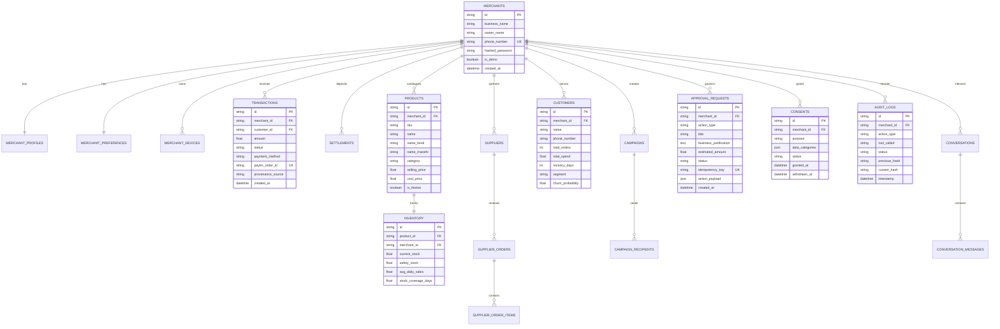

# Gullak AI — Database Entity Relationship (ER) Diagram

```mermaid
erDiagram
    MERCHANTS ||--|| MERCHANT_PROFILES : has
    MERCHANTS ||--|| MERCHANT_PREFERENCES : has
    MERCHANTS ||--o{ MERCHANT_DEVICES : owns
    MERCHANTS ||--o{ TRANSACTIONS : receives
    MERCHANTS ||--o{ SETTLEMENTS : deposits
    MERCHANTS ||--o{ PRODUCTS : catalogues
    MERCHANTS ||--o{ SUPPLIERS : partners
    MERCHANTS ||--o{ CUSTOMERS : serves
    MERCHANTS ||--o{ CAMPAIGNS : creates
    MERCHANTS ||--o{ APPROVAL_REQUESTS : governs
    MERCHANTS ||--o{ CONSENTS : grants
    MERCHANTS ||--o{ AUDIT_LOGS : records
    MERCHANTS ||--o{ CONVERSATIONS : interacts

    PRODUCTS ||--|| INVENTORY : tracks
    SUPPLIERS ||--o{ SUPPLIER_ORDERS : receives
    SUPPLIER_ORDERS ||--o{ SUPPLIER_ORDER_ITEMS : contains
    CAMPAIGNS ||--o{ CAMPAIGN_RECIPIENTS : sends
    CONVERSATIONS ||--o{ CONVERSATION_MESSAGES : contains

    MERCHANTS {
        string id PK
        string business_name
        string owner_name
        string phone_number UK
        string hashed_password
        boolean is_demo
        datetime created_at
    }

    TRANSACTIONS {
        string id PK
        string merchant_id FK
        string customer_id FK
        float amount
        string status
        string payment_method
        string paytm_order_id UK
        string provenance_source
        datetime created_at
    }

    PRODUCTS {
        string id PK
        string merchant_id FK
        string sku
        string name
        string name_hindi
        string name_marathi
        string category
        float selling_price
        float cost_price
        boolean is_festive
    }

    INVENTORY {
        string id PK
        string product_id FK
        string merchant_id FK
        float current_stock
        float safety_stock
        float avg_daily_sales
        float stock_coverage_days
    }

    CUSTOMERS {
        string id PK
        string merchant_id FK
        string name
        string phone_number
        int total_orders
        float total_spend
        int recency_days
        string segment
        float churn_probability
    }

    APPROVAL_REQUESTS {
        string id PK
        string merchant_id FK
        string action_type
        string title
        text business_justification
        float estimated_amount
        string status
        string idempotency_key UK
        json action_payload
        datetime created_at
    }

    AUDIT_LOGS {
        string id PK
        string merchant_id FK
        string action_type
        string tool_called
        string status
        string previous_hash
        string current_hash
        datetime timestamp
    }

    CONSENTS {
        string id PK
        string merchant_id FK
        string purpose
        json data_categories
        string status
        datetime granted_at
        datetime withdrawn_at
    }
```
