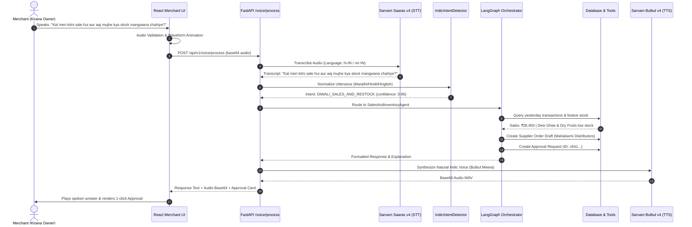

# Gullak AI — Multilingual Voice & Language Pipeline

```mermaid
sequenceDiagram
    autonumber
    actor Merchant as Merchant (Kirana Owner)
    participant UI as React Merchant UI
    participant VoiceRouter as FastAPI /voice/process
    participant SarvamSTT as Sarvam Saaras v4 (STT)
    participant Intent as IndicIntentDetector
    participant Agent as LangGraph Orchestrator
    participant DB as Database & Tools
    participant SarvamTTS as Sarvam Bulbul v4 (TTS)

    Merchant->>UI: Speaks: "Kal meri kitni sale hui aur aaj mujhe kya stock mangwana chahiye?"
    UI->>UI: Audio Validation & Waveform Animation
    UI->>VoiceRouter: POST /api/v1/voice/process (base64 audio)
    VoiceRouter->>SarvamSTT: Transcribe Audio (Language: hi-IN / mr-IN)
    SarvamSTT-->>VoiceRouter: Transcript: "Kal meri kitni sale hui aur aaj mujhe kya stock mangwana chahiye?"
    VoiceRouter->>Intent: Normalize Utterance (Marathi/Hindi/Hinglish)
    Intent-->>VoiceRouter: Intent: DIWALI_SALES_AND_RESTOCK (confidence: 0.96)
    VoiceRouter->>Agent: Route to SalesAndInventoryAgent
    Agent->>DB: Query yesterday transactions & festive stock
    DB-->>Agent: Sales: ₹28,450 | Desi Ghee & Dry Fruits low stock
    Agent->>DB: Create Supplier Order Draft (Mahalaxmi Distributors)
    Agent->>DB: Create Approval Request (ID: c641...)
    Agent-->>VoiceRouter: Formatted Response & Explanation
    VoiceRouter->>SarvamTTS: Synthesize Natural Indic Voice (Bulbul Meera)
    SarvamTTS-->>VoiceRouter: Base64 Audio WAV
    VoiceRouter-->>UI: Response Text + Audio Base64 + Approval Card
    UI->>Merchant: Plays spoken answer & renders 1-click Approval
```
